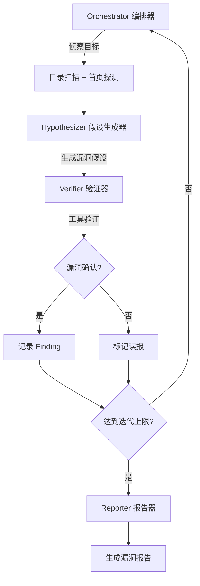

<p align="center">
  
</p>

<h1 align="center">🛡️ Argus</h1>

<p align="center">
  <strong>AI-Powered SRC Vulnerability Mining Multi-Agent System</strong>
</p>

<p align="center">
  
  
  
  
  
  
  
  
  
</p>

<p align="center">
  <a href="./README_EN.md">English</a> | <strong>中文</strong>
</p>

---

## 📖 项目简介

**Argus** 是一个基于 LLM 驱动的多 Agent 协作漏洞挖掘系统，专为 SRC（安全应急响应中心）场景设计。系统通过 4 个智能体节点（编排器、假设生成器、验证器、报告器）组成的 LangGraph 工作流，自动对指定目标进行精准漏洞挖掘，无需大规模扫描即可发现安全漏洞。

## ✨ 核心特性

| 特性 | 说明 |
|------|------|
| 🤖 **多 Agent 协作** | 基于 LangGraph 的 4 节点有向图，各 Agent 专注特定职责 |
| 🎯 **SRC 精准模式** | 仅对指定目标进行测试，无子域名枚举/端口扫描 |
| 🧠 **LLM 推理驱动** | 支持 Anthropic Claude / OpenAI GPT 进行漏洞假设推理 |
| 🔍 **多类型漏洞检测** | SQL 注入、XSS、SSRF、LFI、RCE、IDOR、SSTI 等 |
| 📊 **实时事件流** | WebSocket 推送 Agent 执行状态，前端实时可视化 |
| 📝 **自动报告生成** | 漏洞发现后自动生成结构化报告 |
| 🐳 **一键部署** | Docker Compose 全栈部署，开箱即用 |

## 🏗️ 系统架构

```
┌─────────────────────────────────────────────────────────┐
│                    Frontend (Next.js 15)                  │
│          React 19 + TanStack Query + Zustand             │
└─────────────────────────┬───────────────────────────────┘
                          │ REST API / WebSocket
┌─────────────────────────▼───────────────────────────────┐
│                   Backend (FastAPI)                       │
│    ┌──────────┐  ┌───────────┐  ┌───────────────────┐   │
│    │ Auth/API │  │Event Bus  │  │  Agent Runner     │   │
│    └──────────┘  └───────────┘  └────────┬──────────┘   │
│                                          │               │
│    ┌─────────────────────────────────────▼───────────┐   │
│    │            LangGraph Multi-Agent                 │   │
│    │                                                 │   │
│    │  ┌─────────────┐      ┌──────────────────┐     │   │
│    │  │ Orchestrator│─────▶│  Hypothesizer    │     │   │
│    │  │  (编排器)    │      │  (假设生成器)     │     │   │
│    │  └─────────────┘      └────────┬─────────┘     │   │
│    │         ▲                      │               │   │
│    │         │              ┌───────▼─────────┐     │   │
│    │         │              │    Verifier      │     │   │
│    │         │              │    (验证器)       │     │   │
│    │         │              └───────┬─────────┘     │   │
│    │         │                      │               │   │
│    │         │              ┌───────▼─────────┐     │   │
│    │         └──────────────│    Reporter      │     │   │
│    │                        │    (报告器)       │     │   │
│    │                        └─────────────────┘     │   │
│    └─────────────────────────────────────────────────┘   │
└──────────────┬──────────────────┬───────────────────────┘
               │                  │
    ┌──────────▼──────┐  ┌───────▼──────┐  ┌──────────┐
    │  PostgreSQL 16  │  │   Redis 7    │  │   NATS   │
    │   (数据存储)     │  │  (缓存/队列)  │  │ (消息总线)│
    └─────────────────┘  └──────────────┘  └──────────┘
```

## 🚀 快速开始

### 环境要求

- 🐳 Docker & Docker Compose
- 🔑 AI API Key（Anthropic 或 OpenAI）

### 一键启动

```bash
# 克隆项目
git clone <repo-url> argus && cd argus

# 配置 API Key（选择其一）
export ANTHROPIC_API_KEY="sk-ant-..."
# 或
export OPENAI_API_KEY="sk-..."

# 启动所有服务
make up
# 或
docker compose up -d
```

### 访问系统

| 服务 | 地址 | 说明 |
|------|------|------|
| 🌐 Web 前端 | http://localhost:3000 | 主操作界面 |
| 🔌 后端 API | http://localhost:8000 | RESTful API |
| 📚 API 文档 | http://localhost:8000/docs | Swagger UI |
| 🐘 PostgreSQL | localhost:5432 | 数据库 |
| 📦 Redis | localhost:6379 | 缓存 |
| 📡 NATS | localhost:4222 | 消息总线 |

### 初始配置

1. 访问 `http://localhost:3000` 并注册账户
2. 进入 **系统设置** 页面配置 LLM 供应商（填入 API Key）
3. 创建扫描任务，填入目标 URL
4. 启动任务，在任务监控页面实时查看 Agent 工作

## 📁 项目结构

```
argus/
├── backend/                    # 后端服务
│   ├── app/
│   │   ├── agents/            # 多 Agent 系统
│   │   │   ├── nodes/         # LangGraph 节点（4个Agent）
│   │   │   └── prompts/       # Agent 提示词模板
│   │   ├── api/v1/            # REST API 路由
│   │   ├── core/              # 核心模块（认证、事件总线、配置）
│   │   ├── models/            # SQLAlchemy ORM 模型
│   │   ├── schemas/           # Pydantic 数据模型
│   │   ├── services/          # 业务逻辑层
│   │   ├── tools/             # 安全检测工具集
│   │   └── templates/         # 报告模板
│   ├── alembic/               # 数据库迁移
│   ├── tests/                 # 测试用例
│   └── Dockerfile
├── frontend/                   # 前端服务
│   ├── src/
│   │   ├── app/               # Next.js App Router 页面
│   │   ├── components/        # UI 组件
│   │   ├── hooks/             # React Hooks
│   │   ├── lib/               # 工具库 & API 客户端
│   │   ├── stores/            # Zustand 状态管理
│   │   └── types/             # TypeScript 类型定义
│   └── Dockerfile
├── docker-compose.yml          # 容器编排配置
├── Makefile                    # 常用命令
└── docs/                       # 项目文档
```

## 🔧 安全工具集

| 工具 | 功能 | 对应漏洞类型 |
|------|------|-------------|
| 🌐 `http_requester` | HTTP 请求构造与发送 | 通用验证 |
| 📂 `dir_scanner` | 目录与路径扫描 | 信息泄露 |
| 💉 `sql_injection` | SQL 注入检测 | SQLi |
| 🔗 `ssrf_detector` | SSRF 漏洞检测 | SSRF |
| 🔐 `auth_tester` | 认证绕过测试 | Auth Bypass |
| 🧬 `nuclei_scanner` | Nuclei PoC 扫描 | 已知 CVE |
| 🔀 `payload_mutator` | Payload 变异生成 | WAF 绕过 |
| 🔍 `port_scanner` | 端口探测 | 服务发现 |
| 🌍 `subdomain_enum` | 子域名枚举 | 资产发现 |

## 🛠️ 开发指南

```bash
# 本地启动后端（热重载）
make dev

# 数据库迁移
make migrate

# 运行测试
make test

# 代码检查
make lint

# 代码格式化
make format
```

## 🤝 Agent 工作流程



## 📄 License

MIT License

---

<p align="center">
  <sub>Built with ❤️ for Security Researchers</sub>
</p>
