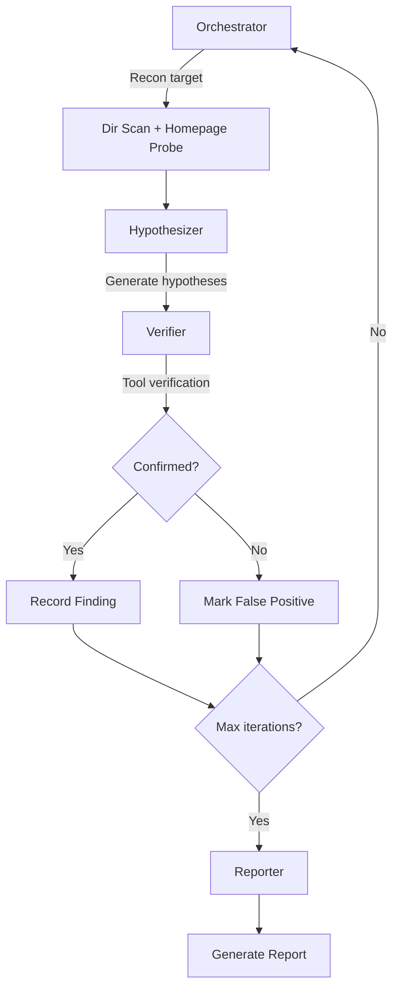

<p align="center">
  
</p>

<h1 align="center">🛡️ Argus</h1>

<p align="center">
  <strong>AI-Powered SRC Vulnerability Mining Multi-Agent System</strong>
</p>

<p align="center">
  
  
  
  
  
  
  
  
  
</p>

<p align="center">
  <strong>English</strong> | <a href="./README.md">中文</a>
</p>

---

## 📖 Overview

**Argus** is an LLM-driven multi-agent vulnerability mining system designed for SRC (Security Response Center) scenarios. The system leverages a LangGraph workflow composed of 4 intelligent agent nodes — Orchestrator, Hypothesizer, Verifier, and Reporter — to automatically perform precision vulnerability discovery against specified targets without aggressive scanning.

## ✨ Key Features

| Feature | Description |
|---------|-------------|
| 🤖 **Multi-Agent Collaboration** | LangGraph-based 4-node directed graph with specialized roles |
| 🎯 **SRC Precision Mode** | Tests only specified targets — no subdomain enumeration or port scanning |
| 🧠 **LLM-Driven Reasoning** | Supports Anthropic Claude / OpenAI GPT for vulnerability hypothesis generation |
| 🔍 **Multi-Type Detection** | SQL Injection, XSS, SSRF, LFI, RCE, IDOR, SSTI, and more |
| 📊 **Real-time Event Stream** | WebSocket-pushed agent execution status with live frontend visualization |
| 📝 **Auto Report Generation** | Structured vulnerability reports generated automatically |
| 🐳 **One-Click Deployment** | Full-stack Docker Compose deployment, ready out of the box |

## 🏗️ Architecture

```
┌─────────────────────────────────────────────────────────┐
│                    Frontend (Next.js 15)                  │
│          React 19 + TanStack Query + Zustand             │
└─────────────────────────┬───────────────────────────────┘
                          │ REST API / WebSocket
┌─────────────────────────▼───────────────────────────────┐
│                   Backend (FastAPI)                       │
│    ┌──────────┐  ┌───────────┐  ┌───────────────────┐   │
│    │ Auth/API │  │Event Bus  │  │  Agent Runner     │   │
│    └──────────┘  └───────────┘  └────────┬──────────┘   │
│                                          │               │
│    ┌─────────────────────────────────────▼───────────┐   │
│    │            LangGraph Multi-Agent                 │   │
│    │                                                 │   │
│    │  ┌─────────────┐      ┌──────────────────┐     │   │
│    │  │ Orchestrator│─────▶│  Hypothesizer    │     │   │
│    │  │             │      │                  │     │   │
│    │  └─────────────┘      └────────┬─────────┘     │   │
│    │         ▲                      │               │   │
│    │         │              ┌───────▼─────────┐     │   │
│    │         │              │    Verifier      │     │   │
│    │         │              │                  │     │   │
│    │         │              └───────┬─────────┘     │   │
│    │         │                      │               │   │
│    │         │              ┌───────▼─────────┐     │   │
│    │         └──────────────│    Reporter      │     │   │
│    │                        │                  │     │   │
│    │                        └─────────────────┘     │   │
│    └─────────────────────────────────────────────────┘   │
└──────────────┬──────────────────┬───────────────────────┘
               │                  │
    ┌──────────▼──────┐  ┌───────▼──────┐  ┌──────────┐
    │  PostgreSQL 16  │  │   Redis 7    │  │   NATS   │
    │   (Storage)     │  │ (Cache/Queue)│  │(Msg Bus) │
    └─────────────────┘  └──────────────┘  └──────────┘
```

## 🚀 Quick Start

### Prerequisites

- 🐳 Docker & Docker Compose
- 🔑 AI API Key (Anthropic or OpenAI)

### Launch

```bash
# Clone the project
git clone <repo-url> argus && cd argus

# Configure API Key (choose one)
export ANTHROPIC_API_KEY="sk-ant-..."
# or
export OPENAI_API_KEY="sk-..."

# Start all services
make up
# or
docker compose up -d
```

### Access

| Service | URL | Description |
|---------|-----|-------------|
| 🌐 Web UI | http://localhost:3000 | Main interface |
| 🔌 Backend API | http://localhost:8000 | RESTful API |
| 📚 API Docs | http://localhost:8000/docs | Swagger UI |
| 🐘 PostgreSQL | localhost:5432 | Database |
| 📦 Redis | localhost:6379 | Cache |
| 📡 NATS | localhost:4222 | Message Bus |

### Initial Setup

1. Visit `http://localhost:3000` and register an account
2. Navigate to **Settings** and configure your LLM provider (enter API Key)
3. Create a scan task with the target URL
4. Start the task and monitor agents working in real-time

## 📁 Project Structure

```
argus/
├── backend/                    # Backend service
│   ├── app/
│   │   ├── agents/            # Multi-agent system
│   │   │   ├── nodes/         # LangGraph nodes (4 agents)
│   │   │   └── prompts/       # Agent prompt templates
│   │   ├── api/v1/            # REST API routes
│   │   ├── core/              # Core modules (auth, event bus, config)
│   │   ├── models/            # SQLAlchemy ORM models
│   │   ├── schemas/           # Pydantic data models
│   │   ├── services/          # Business logic layer
│   │   ├── tools/             # Security testing tools
│   │   └── templates/         # Report templates
│   ├── alembic/               # Database migrations
│   ├── tests/                 # Test suite
│   └── Dockerfile
├── frontend/                   # Frontend service
│   ├── src/
│   │   ├── app/               # Next.js App Router pages
│   │   ├── components/        # UI components
│   │   ├── hooks/             # React Hooks
│   │   ├── lib/               # Utilities & API client
│   │   ├── stores/            # Zustand state management
│   │   └── types/             # TypeScript type definitions
│   └── Dockerfile
├── docker-compose.yml          # Container orchestration
├── Makefile                    # Common commands
└── docs/                       # Documentation
```

## 🔧 Security Tools

| Tool | Function | Vulnerability Type |
|------|----------|-------------------|
| 🌐 `http_requester` | HTTP request builder & sender | General verification |
| 📂 `dir_scanner` | Directory & path scanning | Information disclosure |
| 💉 `sql_injection` | SQL injection detection | SQLi |
| 🔗 `ssrf_detector` | SSRF vulnerability detection | SSRF |
| 🔐 `auth_tester` | Authentication bypass testing | Auth Bypass |
| 🧬 `nuclei_scanner` | Nuclei PoC scanning | Known CVEs |
| 🔀 `payload_mutator` | Payload mutation generation | WAF bypass |
| 🔍 `port_scanner` | Port discovery | Service enumeration |
| 🌍 `subdomain_enum` | Subdomain enumeration | Asset discovery |

## 🛠️ Development

```bash
# Start backend locally (hot reload)
make dev

# Run database migrations
make migrate

# Run test suite
make test

# Lint code
make lint

# Format code
make format
```

## 🤝 Agent Workflow



## 🔄 Agent Roles

| Agent | Role | Responsibility |
|-------|------|---------------|
| 🟣 **Orchestrator** | Coordinator | Performs reconnaissance, manages workflow decisions, routes to next agent |
| 🟡 **Hypothesizer** | Analyst | Generates vulnerability hypotheses based on recon data using LLM reasoning |
| 🔴 **Verifier** | Validator | Executes security tools to confirm or reject hypotheses |
| 🟢 **Reporter** | Documenter | Compiles confirmed findings into structured vulnerability reports |

## ⚙️ Tech Stack

### Backend
- **Framework**: FastAPI + Uvicorn
- **AI/Agent**: LangGraph + LangChain (Anthropic/OpenAI)
- **Database**: PostgreSQL 16 + SQLAlchemy (async)
- **Cache**: Redis 7
- **Messaging**: NATS (JetStream)
- **Auth**: JWT (python-jose)
- **Migrations**: Alembic

### Frontend
- **Framework**: Next.js 15 (App Router)
- **UI**: React 19 + Tailwind CSS
- **State**: Zustand + TanStack Query
- **Icons**: Lucide React
- **Real-time**: WebSocket

## 📄 License

MIT License

---

<p align="center">
  <sub>Built with ❤️ for Security Researchers</sub>
</p>
